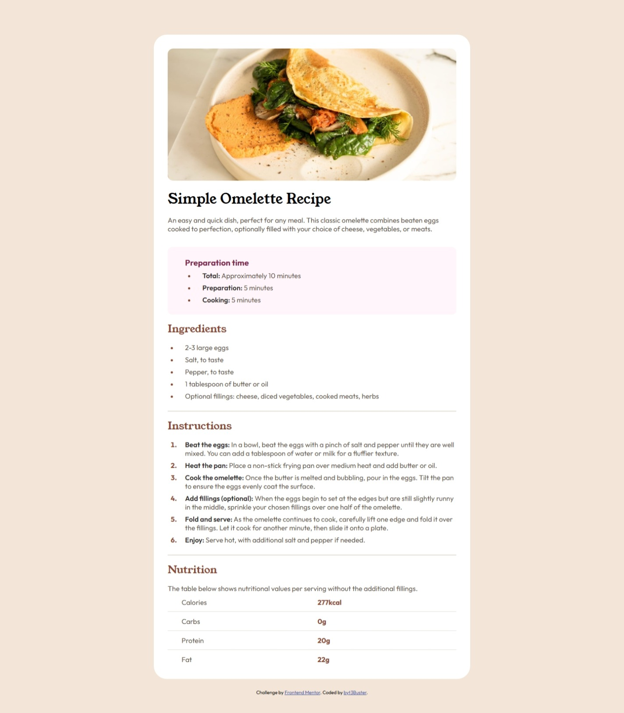
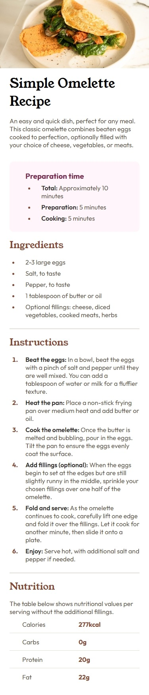

# Frontend Mentor - Recipe page solution

This is a solution to the [Recipe page challenge on Frontend Mentor](https://www.frontendmentor.io/challenges/recipe-page-KiTsR8QQKm). Frontend Mentor challenges help you improve your coding skills by building realistic projects. 

## Table of contents

- [Overview](#overview)
  - [The challenge](#the-challenge)
  - [Screenshot](#screenshot)
  - [Links](#links)
- [My process](#my-process)
  - [Built with](#built-with)
  - [What I learned](#what-i-learned)
- [Author](#author)

## Overview

### Screenshot

Desktop Screenshot :

Mobile Screenshot :

### Links

- Solution URL: [Add solution URL h](https://your-solution-url.com)
- Live Site URL: [https://recipe-page-bice-chi.vercel.app/](https://recipe-page-bice-chi.vercel.app/)

## My process

### Built with

- Semantic HTML5 markup
- CSS custom properties
- Flexbox
- CSS Grid
- Mobile-first workflow

### What I learned

This challenge taught me a lot! I learned new concepts such as media queries, the CSS overflow property, how to clearly comment my code, semantic HTML elements, the use of variables, and much more.

Although I faced some difficulties—especially with media queries—I managed to overcome them thanks to solutions shared by other community members, ChatGPT (of course 😁 — but no copy-pasting ✊), and Zeal Doc, which helped me get a better overview of HTML and CSS elements.

Huge thanks to everyone!!!

## Author

- Github - [byt3Buster](https://www.github/byt3Buster.com)
- Frontend Mentor - [@byt3Buster](https://www.frontendmentor.io/profile/byt3Buster)
